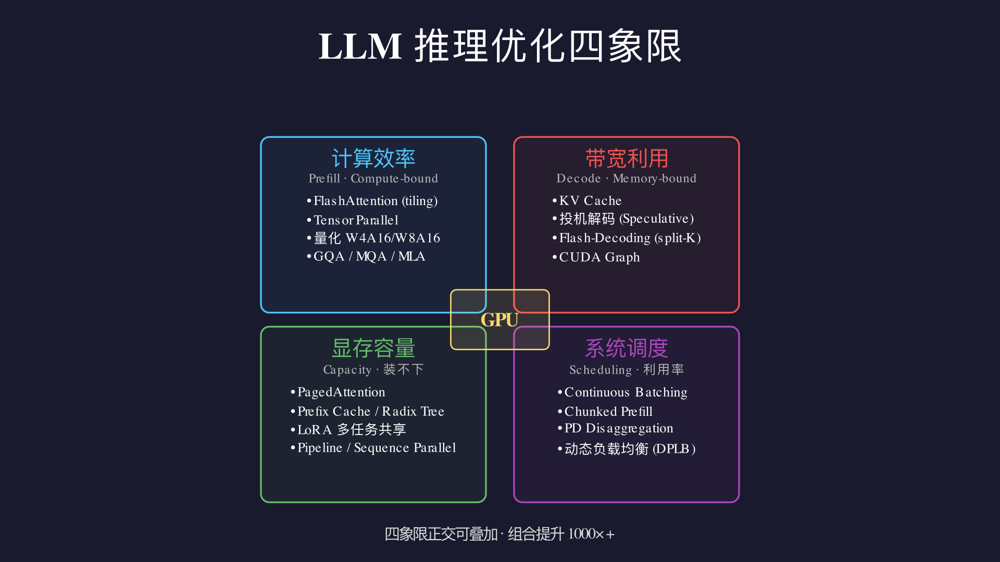

# 总结：大模型推理服务的配置、指标与优化

本文是 mini-vllm-tutorial 全部 15 步的总结。经过从零实现，我们已经理解了 LLM 推理引擎的每一个核心组件。现在把这些知识汇聚成一张实际运维的地图：**上线一个推理服务，需要关注什么、监控什么、从哪里找优化空间。**

---

## 一、系统配置：上线前的关键决策

### 1. KV Cache 显存预算

KV Cache 是推理服务中最核心的资源，直接决定系统能同时服务多少请求。

```
KV Cache 显存 = num_layers × 2(K+V) × num_kv_heads × head_dim × max_total_tokens × dtype_bytes

Qwen3-0.6B 示例（BF16）:
  = 28 × 2 × 8 × 64 × max_tokens × 2字节
  = 57,344 字节 × max_tokens
  ≈ 56KB / token

A100 80GB，模型权重占 1.2GB，剩余约 78GB：
  最多缓存约 78GB / 56KB ≈ 1,400,000 个 token 的 KV
```

实际配置时 `gpu_memory_utilization`（vLLM 默认 0.9）控制留给 KV Cache 的显存比例。

### 2. 并发数与 max_num_seqs

`max_num_seqs`：调度器同时运行的最大请求数。

```
设太小 → GPU 利用率低，吞吐量上不去
设太大 → 每个请求等待的其他请求变多，平均延迟上升
         且 KV Cache 可能不够，触发频繁 Preemption（见 Preemption：抢占避免 OOM）

经验值：先用 max_num_seqs = 总KV槽位 / 平均序列长度 作为上限
```

### 3. chunk_size（Chunked Prefill）

控制每步最多处理的 prefill token 数（Chunked Prefill：切片长 Prompt）。

```
chunk_size 小（如 256）：
  → decode 请求每步延迟增加少（每步 prefill 时间短）
  → 长 prompt 的 TTFT 更长（需要更多步）
  
chunk_size 大（如 2048）：
  → 长 prompt TTFT 更短
  → decode 请求每步可能卡顿更明显

推荐：根据实际负载的 prompt 长度分布调整。
      nano-vllm 默认 512，vLLM 默认 512。
```

### 4. block_size（PagedAttention）

KV Cache 的分配粒度（PagedAttention：分页内存管理）。

```
block_size 小（如 8）：
  → 内存碎片少，利用率高
  → Block 数量多，block_table 查找开销稍大

block_size 大（如 32）：
  → 管理开销小
  → 最后一个 Block 可能有较多未用槽位

推荐：16 或 32，通常不需要调整。
```

### 5. 精度选择

| 精度 | 显存 | 速度 | 精度损失 | 适用场景 |
|------|------|------|---------|---------|
| FP32 | 4字节/参数 | 慢 | 无 | 训练、调试 |
| BF16 | 2字节/参数 | 快 | 极小 | 推理标准选择 |
| INT8 | 1字节/参数 | 更快 | 小 | 显存紧张时 |
| INT4 | 0.5字节/参数 | 最快 | 中等 | 极限压缩 |

本教程 真实模型：加载 Qwen3-0.6B 起使用 BF16，是生产推理的标准选择。

---

## 二、核心指标：监控什么

### 延迟指标

```
TTFT（Time to First Token）= 从请求发出到返回第一个 token 的时间
  主要受 Prefill 影响，随 prompt 长度增加而增加（O(n²)）
  典型目标：< 500ms（对话场景）

TPOT（Time Per Output Token）= 每个生成 token 的平均时间
  主要受 Decode 影响，GPU 显存带宽是瓶颈
  典型目标：< 50ms/token（即 > 20 tok/s）

E2EL（End-to-End Latency）= 完整请求的总时间
  = TTFT + TPOT × (output_len - 1)
```

### 吞吐量指标

```
Throughput = 单位时间生成的 token 总数（tok/s）
  衡量系统整体处理能力，与 batch size 强相关
  
RPS（Requests Per Second）= 每秒处理的完整请求数
  = Throughput / 平均输出长度

典型优先级：
  在线服务（聊天）：优先低延迟（TTFT < 500ms）
  离线批处理（摘要、翻译）：优先高吞吐（tok/s 最大化）
```

### 资源指标

```
GPU 利用率（Compute Utilization）
  Prefill 阶段：计算密集，利用率高（应接近 100%）
  Decode 阶段：内存带宽密集，利用率可能较低（正常）
  持续低（< 30%）：请求量不足 或 调度效率低

GPU 显存利用率
  KV Cache 占用：应尽量高（步骤 PagedAttention：分页内存管理 的目标是 ~96%）
  持续低（< 50%）：max_num_seqs 设置过小，或请求量不足

KV Cache 命中率（Prefix Cache Hit Rate）
  = 命中缓存的 Block 数 / 总请求的 Block 数
  系统提示词场景下应 > 80%
  接近 0：无重复前缀，不适合前缀缓存

Preemption 次数
  频繁 Preemption（Preemption：抢占避免 OOM）说明 KV Cache 不够用
  需要减少 max_num_seqs 或增加显存
```

### 队列指标

```
Waiting Queue Length = 等待调度的请求数
  持续增长：系统过载，处理速度跟不上请求到达速度
  
Scheduling Delay = 请求等待进入 running 队列的时间
  正常应 < 100ms
  过高：调度器频繁 Preemption 或 chunk_size 设置不合理
```

---

## 三、寻找优化空间：瓶颈分析

优化推理服务的第一步是**找到瓶颈在哪里**，不同瓶颈的优化方向完全不同。

### 瓶颈诊断树

```
TTFT 高？
  ├─ prompt 很长（> 1024 token）？
  │    → 减小 chunk_size，让 decode 不被阻塞（Chunked Prefill：切片长 Prompt）
  │    → 开启 Prefix Caching，相同前缀复用（Prefix Caching：相同前缀只算一次）
  └─ prefill 本身慢？
       → 换更快的 GPU，或开启 FlashAttention（FlashAttention：SRAM-aware 注意力计算）

TPOT 高（生成慢）？
  ├─ GPU 利用率低（< 60%）？
  │    → 增大 max_num_seqs，提高并发（Continuous Batching 调度器）
  │    → 检查 Preemption 是否频繁（Preemption：抢占避免 OOM）
  └─ GPU 利用率高（> 90%）但仍慢？
       → Decode 已到显存带宽上限，需要更好的 GPU 或 Tensor Parallelism（Tensor Parallelism：多卡分布式推理）

Throughput 低？
  ├─ KV Cache 利用率低（< 60%）？
  │    → 增大 max_num_seqs
  │    → 检查 PagedAttention 配置（PagedAttention：分页内存管理）
  └─ 队列持续增长？
       → 系统过载，需要扩容（更多 GPU 或 Tensor/Pipeline Parallelism）

Preemption 频繁？
  → KV Cache 不够，选一个：
     a. 减少 max_num_seqs（降低并发）
     b. 减小 max_model_len（限制最大序列长度）
     c. 换更大显存的 GPU
     d. 降低精度（BF16 → INT8，节省显存）
```

### 各步骤的优化效果速查

| 优化手段 | 对应步骤 | 主要收益 | 代价 |
|---------|---------|---------|------|
| KV Cache | 单请求 KV Cache | Decode 速度提升 10-100× | 显存占用增加 |
| Continuous Batching | Continuous Batching 调度器 | 吞吐量提升 2-5× | 实现复杂度 |
| Chunked Prefill | Chunked Prefill：切片长 Prompt | TPOT 稳定，TTFT 改善 | 长 prompt TTFT 微增 |
| Preemption | Preemption：抢占避免 OOM | 避免 OOM，稳定性提升 | 被抢占请求需重新 prefill |
| PagedAttention | PagedAttention：分页内存管理 | 显存利用率 ~18% → ~96% | block_table 管理开销 |
| Prefix Caching | Prefix Caching：相同前缀只算一次 | 相同前缀节省 50-90% prefill | 显存常驻，需要 LRU 管理 |
| FlashAttention | FlashAttention：SRAM-aware 注意力计算 | 注意力计算速度 2-4×，显存大幅减少 | 需要 NVIDIA GPU |
| CUDA Graph | CUDA Graph：录制重放，跳过调度层 | Decode 延迟降低 30-60% | 只对 Decode 有效 |
| Tensor Parallelism | Tensor Parallelism：多卡分布式推理 | 线性扩展吞吐，支持更大模型 | 需要多 GPU + NVLink |

### 实际优化流程

```
第一步：建立基线
  python step18_benchmark/run.py
  记录：TTFT P50/P95/P99，TPOT，Throughput，GPU利用率，显存使用

第二步：确定主要瓶颈
  用上面的「瓶颈诊断树」判断当前限制在哪里

第三步：单变量实验
  每次只改一个配置，重新跑 benchmark，对比数据
  常见旋钮：
    max_num_seqs：10 → 20 → 40 → 80
    chunk_size：128 → 256 → 512 → 1024
    gpu_memory_utilization：0.7 → 0.8 → 0.9

第四步：检查是否引入新问题
  优化吞吐量时：TTFT 是否变高了？
  优化 TTFT 时：Throughput 是否下降了？
  这些权衡通常无法避免，找到业务可接受的平衡点
```

---

## 四、本教程覆盖的技术栈

```
用户请求
    │
    ▼
HTTP 服务（HTTP Serve：OpenAI 兼容推理服务）
FastAPI + SSE 流式输出 + asyncio 异步队列
    │
    ▼
调度器（Continuous Batching 调度器 + Chunked Prefill：切片长 Prompt + Preemption：抢占避免 OOM）
Continuous Batching → Chunked Prefill → Preemption
    │
    ▼
内存管理（PagedAttention：分页内存管理 + Prefix Caching：相同前缀只算一次）
PagedAttention → Prefix Caching
    │
    ▼
模型推理（真实模型：加载 Qwen3-0.6B + FlashAttention：SRAM-aware 注意力计算 + CUDA Graph：录制重放，跳过调度层 + Tensor Parallelism：多卡分布式推理）
Qwen3-0.6B → FlashAttention → CUDA Graph → Tensor Parallelism
    │
    ▼
基础组件（Tokenizer：文字变数字~单请求 KV Cache）
Tokenizer → Embedding → Attention → Transformer → KV Cache
    │
    ▼
指标采集（Benchmark：量化优化效果）
TTFT / TPOT / Throughput / GPU 利用率 / KV 命中率
```

---

## 五、与 nano-vllm 的差距

本教程是教学实现，与生产级推理引擎（nano-vllm、vLLM）的主要差距：

| 特性 | mini-vllm-tutorial | nano-vllm |
|------|-------------------|-----------|
| KV Cache 存储 | Python list（HuggingFace 风格） | 物理显存块，Triton kernel 写入 |
| 注意力计算 | PyTorch SDPA | FlashAttention varlen（prefill）+ with_kvcache（decode）|
| Batch 注意力 | 逐请求 for 循环 | 真正的变长 batch，一次 kernel |
| 采样 | Python argmax/multinomial | Gumbel-Max + `@torch.compile` |
| Tensor Parallel | 单进程模拟 | multiprocessing + NCCL all_reduce |
| 性能（A100，Qwen3-0.6B）| ~50 tok/s（教学版）| ~1400 tok/s |

差距约 28×，来自每一层的工程优化叠加。理解了本教程的每个步骤，再去读 nano-vllm 的源码，每一行都能对应到这里学到的概念。

---

## 进阶系列索引（adv01–adv16）

主系列 15 步之外，[`advanced/`](advanced/README.md) 另有 16 步进阶优化，覆盖主系列未讲的推理优化手段。每步独立可运行（`python run.py`）。

| 优化手段 | 对应步骤 | 代码深度 | 主要收益 | 代价 |
|---------|---------|---------|---------|------|
| 量化 W4A16/W8A16 | adv01 | 🟢 真代码 | 显存↓4–8×，速度↑ | 精度损失 |
| 采样进阶 MinP/Penalty/Beam | adv02 | 🟢 | 输出可控 | — |
| 投机解码 Speculative Decoding | adv03 | 🟢 | decode 2–3× | 草稿模型开销 |
| Flash-Decoding | adv04 | 🟡 模拟 | 长序列 decode↑ | 需分块 |
| Radix Attention + CoW | adv05 | 🟢 | 前缀复用↑ | 树管理 |
| Pipeline Parallel (PP) | adv06 | 🟡 模拟 | 支持更大模型 | bubble |
| Sequence Parallel (SP) | adv07 | 🟡 模拟 | 序列维切分 | 通信 |
| Data Parallel + DPLB | adv08 | 🟢 | 多副本均衡 | 副本开销 |
| TBO/DBO 计算通信重叠 | adv09 | 🟡 模拟 | 计算-通信重叠 | 复杂调度 |
| PD Disaggregation | adv10 | 🟡 模拟 | 吞吐↑ | KV 迁移 |
| AFD (Attention/FFN 分离) | adv11 | 🟡 模拟 | A/F 配比均衡 | 跨设备通信 |
| MoE + EPLB | adv12 | 🟢 | 稀疏激活省算力 | 路由+均衡 |
| Linear Attention / SSM | adv13 | 🟢 | 长序列 O(n) | 精度近似 |
| Multi-LoRA | adv14 | 🟢 | 多任务共享 base | 适配器管理 |
| Guided Decoder | adv15 | 🟢 | 结构化输出 | 约束开销 |
| Function Call / Tool Call | adv16 | 🟢 | 工具调用 | 循环延迟 |
| Logits Tricks 工具箱 | adv17 | 🟢 | 输出控制(分类/禁止/偏置) | — |

> 🟢 = 真代码可跑；🟡 = 单机 CPU 难以真实实现，用模拟器/图解讲清原理，README 已诚实标注"非真实加速"。

---

## 六、推理优化的第一性原理框架

> 以下从硬件物理约束出发，推导出 LLM 推理优化的完整技术地图。
> 不是"罗列技术"，而是"为什么这些技术必然存在"。



### 6.1 从硬件出发：GPU 的三大资源

一张 GPU 能提供的资源恰好三种：

```
┌─────────────────────────────────────────────────────────────┐
│                     GPU 三大资源                              │
├──────────────┬──────────────────┬───────────────────────────┤
│ 算力 (FLOPS) │ 带宽 (Bandwidth) │ 容量 (Capacity)            │
│ A100: 312T   │ A100: 2.0 TB/s   │ A100: 80 GB               │
│ H100: 990T   │ H100: 3.35 TB/s  │ H100: 80 GB               │
├──────────────┼──────────────────┼───────────────────────────┤
│ "能算多快"    │ "能搬多快"        │ "能装多少"                 │
└──────────────┴──────────────────┴───────────────────────────┘
```

**Roofline 模型：** 任何计算任务的性能上限由 **算术强度（Arithmetic Intensity, AI）** 决定：

```
AI = 计算量(FLOP) / 数据搬运量(Bytes)

                    ▲ 实际 FLOPS
                    │          ╱ ← 峰值算力天花板 (312 TFLOPS)
                    │        ╱
                    │      ╱  ← 算力受限区（Compute-bound）
                    │    ╱
                    │  ╱─────────────────────────
                    │╱        ↑ 带宽受限区（Memory-bound）
                    ┼─────────────────────────→ AI (FLOP/Byte)
                          ↑
                    拐点 = 峰值FLOPS / 峰值带宽
                    A100: 312T / 2.0T = 156 FLOP/Byte
```

**LLM 推理两阶段的本质差异：**

```
Prefill（处理 prompt）:
  输入: [seq, hidden]，做矩阵乘 + attention
  计算量 ∝ seq × hidden²    ← 大量计算
  搬运量 ∝ hidden²          ← 权重搬一次
  AI = seq × hidden² / hidden² = seq ≈ 512~4096
  → 远超拐点 → Compute-bound ← GPU 算力是瓶颈

Decode（逐 token 生成）:
  输入: [1, hidden]，每步只算 1 个 token
  计算量 ∝ 1 × hidden²     ← 很少计算
  搬运量 ∝ hidden²          ← 权重仍要搬一次！
  AI = 1 × hidden² / hidden² = 1
  → 远低于拐点 → Memory-bound ← GPU 带宽是瓶颈
```

**结论：Prefill 瓶颈在算力，Decode 瓶颈在带宽。两阶段需要完全不同的优化策略。**

---

### 6.2 象限一：计算效率优化（Compute-bound，Prefill 为主）

> 硬件约束：算力有限。当计算量大到超过 GPU 算力时，需要减少无效计算或并行化。

```
瓶颈推导链：
  长 prompt → attention 计算 O(seq²·d) → 单卡算力不够
  ├→ 减少无效 IO：FlashAttention（tiling，不存 seq² 矩阵）  [step15]
  ├→ 多卡分摊算力：Tensor Parallel（切 hidden 维）           [step17]
  ├→ 减少计算量：量化（W4A16，用 4-bit 权重做 16-bit 计算）  [adv01]
  └→ 减少 KV 头数：GQA/MQA（多 Q 头共享 KV 头）             [业界]
```

**FlashAttention（step15）：** 标准 attention 必须存储 [seq, seq] 的注意力矩阵（显存 O(seq²)）。FlashAttention 用 **tiling + online softmax** 把大矩阵切成 SRAM 能容纳的小块，逐块计算后流式合并，永远不在 HBM 中实例化完整矩阵。

```
标准 attention:  HBM → [seq²矩阵] → HBM → softmax → HBM → ×V → HBM
                       ↑ 4 次 HBM 读写

FlashAttention:  HBM → [小块] → SRAM → 计算 → 累积 → 最终写回 HBM
                       ↑ 仅 1 次读 + 1 次写，中间全在 SRAM
```

**Tensor Parallel（step17）：** 单卡算力不够时，把同一层的矩阵乘法切到多卡并行。每卡算 hidden/N 的部分，最后 AllReduce 合并。通信开销 = 每层 2 次 AllReduce。

**量化 W4A16（adv01）：** 权重从 FP16（2B/参数）压缩到 INT4（0.5B/参数），Prefill 时每搬 1 字节权重能做更多计算（等效提升 AI），且总数据搬运量减少 4×。

**业界延伸：**
- **MLA（Multi-head Latent Attention, DeepSeek-V3）：** 把 KV 投影到低维潜空间，KV Cache 大小降低 8-16×
- **GQA/MQA（Llama-2/3, Mistral）：** 多个 Q 头共享一组 KV 头，减少 KV 计算量和存储

---

### 6.3 象限二：带宽利用优化（Memory-bound，Decode 为主）

> 硬件约束：HBM 带宽有限。Decode 时每步只生成 1 个 token，但仍需搬运全部权重。
> 核心矛盾：权重搬运量固定（模型大小），但只做 1 个 token 的计算 → 带宽严重浪费。

```
瓶颈推导链：
  每步 decode 搬运全部权重 → 带宽利用率极低
  ├→ 避免重复计算：KV Cache（存历史 K/V，不重算）                [step07]
  ├→ 攒一批验证：投机解码（小模型猜 k 个，大模型 1 次验证）       [adv03]
  ├→ 提高并行度：Flash-Decoding（split-K 切 KV，多 SM 并行）    [adv04]
  ├→ 消除调度开销：CUDA Graph（录制 kernel 序列，重放跳过 CPU）   [step16]
  └→ 塞更多请求：Continuous Batching（多请求共享一次权重搬运）    [step09]
```

**KV Cache（step07）：** 自回归生成第 t 步时，标准 attention 需要重新计算前 t-1 步的 K/V。KV Cache 把已算过的 K/V 存在显存中，每步只算新 token 的 K/V，然后拼接历史。将 decode 的计算从 O(t·d) 降为 O(d)。

**投机解码（adv03）：** 核心是**批处理思想**——让小模型猜 k 个 token，然后大模型一次 forward 并行验证 k 个位置。搬一次权重做 k 个 token 的工作，等效将 decode 的 AI 从 1 提升到 k。

```
标准 decode:  搬 1 次权重 → 生成 1 token → AI = 1
投机 decode:  搬 1 次权重 → 验证 k token → AI ≈ k
加速条件: 接受率高（同族模型 70-90%）+ 草稿模型够快（>5× faster）
```

**Flash-Decoding（adv04）：** Decode 时 Q 只有 1 行，无法沿 Q 方向并行。Flash-Decoding 转而沿 KV 方向切分：把长 KV 切成多段，分配给不同 SM 并行计算局部 attention，最后用 online softmax 归约。

**CUDA Graph（step16）：** Decode 每步计算量极小（~0.1ms），但 Python → CUDA driver → kernel launch 的调度开销可达 0.05ms/kernel。CUDA Graph 录制整个 decode step 的 kernel 序列，之后直接重放，跳过 CPU 调度层，延迟降低 30-60%。

**业界延伸：**
- **Medusa/EAGLE：** 投机解码变体，用轻量头直接预测多 token，无需独立草稿模型
- **Continuous Batching 填满带宽：** 多请求共享一次权重读取，等效提升 batch AI

---

### 6.4 象限三：显存容量优化（Capacity）

> 硬件约束：GPU 显存有限（80GB）。大模型权重 + KV Cache + 激活 三者竞争有限空间。
> 核心矛盾：想服务更多并发、更长序列、更大模型，但显存装不下。

```
瓶颈推导链：
  显存不够 →
  ├→ 权重太大：量化（INT4/INT8 压缩权重）                          [adv01]
  ├→ KV 碎片浪费：PagedAttention（分页管理，按需分配）              [step12]
  ├→ KV 重复存储：Prefix Cache（共享前缀 KV block）                [step13, adv05]
  ├→ 多任务显存爆炸：LoRA（共享 base + 微小 adapter）              [adv14]
  ├→ 单卡装不下模型：Pipeline Parallel（层间切分到多卡）            [adv06]
  ├→ 激活太大：Sequence Parallel（序列维切到多卡）                  [adv07]
  └→ KV Cache 本身太大：KV 量化（4-bit KV Cache）                  [业界]
```

**PagedAttention（step12）：** 传统连续内存分配在请求结束前无法回收空间，内部碎片率高达 60-80%。PagedAttention 借鉴 OS 虚拟内存，把 KV Cache 拆成固定大小的 block（如 16 token/block），通过 block_table 映射逻辑位置到物理块。显存利用率从 ~18% 提升到 ~96%。

```
连续分配:  [req0: ████████░░░░░░░░]  ← 预分配 max_len，大量空闲
           [req1: ██████░░░░░░░░░░]
           碎片率 > 60%

PagedAttn: [blk0|blk1|blk2|blk3|blk4|blk5|...]  ← 按需分配 block
           req0 → [blk0, blk2, blk5]  req1 → [blk1, blk3]
           利用率 > 96%
```

**Prefix Cache（step13, adv05）：** 多个请求共享相同 system prompt 时，Prefix Cache 让 KV block 被多个请求引用（CoW 语义），避免重复计算和存储。adv05 用 Radix Tree 实现前缀匹配。

**LoRA（adv14）：** 多任务场景下，每任务全量模型 = N × 模型大小。LoRA 让所有任务共享一个 base 模型，每任务只额外存 2dr 参数（<1%），切换只换指针。

**业界延伸：**
- **KV Cache 量化（vLLM FP8 KV）：** 把 KV Cache 从 FP16 压缩到 FP8/INT4，容量翻倍
- **Paged KV + Speculative Decode 组合：** 投机解码的临时 KV 也用分页管理

---

### 6.5 象限四：系统级调度优化（Scheduling）

> 硬件约束：GPU 一次只能跑一个 kernel 序列。多请求、变长序列、prefill/decode 混合场景下，如何最大化硬件利用率？
> 核心矛盾：请求到达时间不同、长度不同、阶段不同 → 简单调度导致 GPU 空闲或内存爆炸。

```
瓶颈推导链：
  多请求调度 →
  ├→ 静态 batch 浪费：Continuous Batching（动态增删请求）           [step09]
  ├→ 长 prefill 阻塞 decode：Chunked Prefill（分片处理）           [step10]
  ├→ 显存溢出：Preemption（抢占 + swap/recompute）                 [step11]
  ├→ Prefill/Decode 互相干扰：PD Disaggregation（分离部署）         [adv10]
  ├→ Attention/FFN 负载不均：AFD（分离到不同设备组）                 [adv11]
  ├→ 多副本负载不均：DPLB（动态负载均衡）                           [adv08]
  └→ 计算与通信串行：TBO/DBO Overlap（重叠调度）                    [adv09]
```

**Continuous Batching（step09）：** Static batching 要等一批请求全部生成完才能开始下一批，短请求被长请求拖累。Continuous Batching 每步都可以加入新请求或移除已完成请求，GPU 永远满载。

```
Static Batch:
  [req0: ████████████]
  [req1: ████░░░░░░░░]  ← req1 早完成但必须等 req0
  GPU idle: ████████

Continuous Batch:
  [req0: ████████████]
  [req1: ████][req2: ████████]  ← req1 完成后 req2 立即顶上
  GPU idle: 0
```

**Chunked Prefill（step10）：** 长 prompt 的 prefill 可能耗时几百 ms，期间所有 decode 请求被阻塞。Chunked Prefill 把长 prefill 切成固定大小的 chunk（如 512 token），每个调度步只处理一个 chunk，中间穿插 decode token 生成，保证 decode 延迟稳定。

**PD Disaggregation（adv10）：** Prefill 是 compute-bound，Decode 是 memory-bound。混在一起跑时，两者互相干扰（prefill 抢计算资源影响 decode 延迟，decode 的小 batch 浪费 prefill 的计算能力）。分离部署让 prefill 节点专注吞吐、decode 节点专注延迟。

**业界延伸：**
- **SGLang RadixAttention：** 用 Radix Tree 统一管理 prefix cache + 调度
- **Mooncake（月饼）：** 分离式推理架构，prefill/decode 完全独立的硬件池
- **DistServe / Splitwise：** PD 分离 + 跨节点 KV 迁移优化

---

### 6.6 技术组合的叠加效应

上述优化**正交可叠加**——它们攻击不同瓶颈，不互相冲突：

```
典型生产配置（如 vLLM 部署 Llama-3-70B）：

  FlashAttention          ← 象限一：Prefill 计算效率
  + Tensor Parallel (8卡)  ← 象限一：多卡分摊
  + INT4 量化 (AWQ)        ← 象限一+三：减搬运 + 省显存
  + PagedAttention         ← 象限三：消除 KV 碎片
  + Prefix Caching         ← 象限三：共享 system prompt
  + Continuous Batching    ← 象限四：动态调度
  + Chunked Prefill        ← 象限四：不阻塞 decode
  + CUDA Graph             ← 象限二：消除 launch 开销

  叠加效果：单独每项 1.3-4× 提升，组合后 vs 朴素实现可达 50-100× 总提升
```

**叠加的前提是正交性：**

| 组合 | 是否正交 | 说明 |
|------|---------|------|
| FlashAttn + PagedAttn | ✓ | FlashAttn 加速计算，PagedAttn 管理存储 |
| 量化 + KV Cache | ✓ | 权重量化不影响 KV Cache 存储方式 |
| 投机解码 + ContBatch | ✓ | 投机在单请求维度，ContBatch 在多请求维度 |
| Chunked Prefill + CUDA Graph | ✓ | Chunk 控制 prefill 粒度，Graph 加速 decode |
| TP + PP | ✓ | TP 切层内（hidden），PP 切层间（layers） |
| PD 分离 + 投机解码 | ⚠️ | 需要 KV 迁移配合，有额外通信开销 |

---

### 6.7 全景图：从朴素实现到生产级引擎

```
朴素 LLM 推理（step05）
  │  每步重算全部 attention，无 batch，纯 Python
  │  ~1 tok/s
  │
  ├─ + KV Cache (step07)                    → ~10 tok/s      ← 避免重复计算
  ├─ + Continuous Batching (step09)         → ~50 tok/s      ← 多请求并行
  ├─ + PagedAttention (step12)              → 并发数 5-10×    ← 显存利用率↑
  ├─ + FlashAttention (step15)              → Prefill 2-4×   ← 计算效率↑
  ├─ + CUDA Graph (step16)                  → Decode 1.5×    ← 调度开销↓
  ├─ + Tensor Parallel 8卡 (step17)         → ~8× 算力       ← 多卡线性扩展
  ├─ + INT4 量化 (adv01)                    → 显存 4× + 速度↑ ← 压缩权重
  └─ 生产级引擎 (vLLM/SGLang)               → ~1400 tok/s    ← 全部叠加

  总提升: ~1400× (vs 朴素实现)
```

---

### 6.8 本项目知识地图索引

按四象限重新索引全部 31 步：

**象限一：计算效率**
- step03 Attention 基础 → step15 FlashAttention → step17 Tensor Parallel
- adv01 量化 → adv07 Sequence Parallel

**象限二：带宽利用**
- step07 KV Cache → step16 CUDA Graph
- adv03 投机解码 → adv04 Flash-Decoding → adv09 TBO/DBO Overlap

**象限三：显存容量**
- step12 PagedAttention → step13 Prefix Cache → adv05 Radix Tree
- adv06 Pipeline Parallel → adv14 Multi-LoRA → adv01 量化

**象限四：系统调度**
- step08 Static Batching → step09 Continuous Batching → step10 Chunked Prefill → step11 Preemption
- adv08 DPLB → adv10 PD Disaggregation → adv11 AFD

**模型架构变体**
- adv12 MoE + EPLB → adv13 Linear Attention/SSM

**服务工程**
- step06 Sampler → adv02 采样进阶 → adv15 Guided Decoder → adv16 Function Call → adv17 Logits Tricks
- step18 Benchmark → step19 Real Model → step20 HTTP Serve

---

*mini-vllm-tutorial 完结。主系列 20 步 + 进阶 17 步，共 37 步，覆盖从零实现到生产级推理优化的完整知识地图。*
